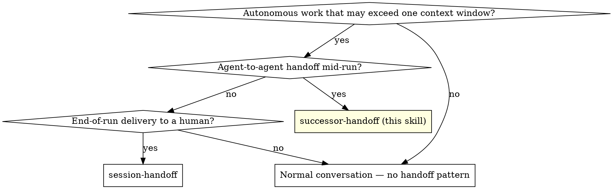
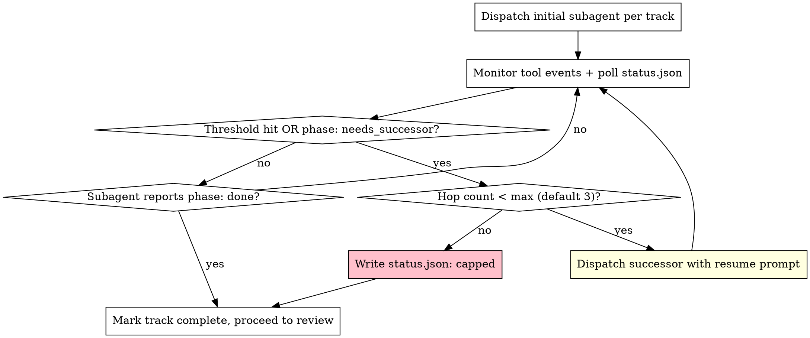

# Successor Handoff

A pattern for running many-hour autonomous workflows without hitting a single context window.

Three rules, one parent, many successor hops. The parent never fills up because it reads only status files. Each track's subagent stays lean via file-first discipline. When a subagent's context does start to swell, a fresh successor spawns in seconds with the filesystem as its memory — no human in the loop, no narrative compression.

## The Problem

Autonomous workflows that need many hours of wall-clock time — overnight research, multi-track experiments, 10-hour BigQuery exploration — cannot fit in a single Claude context window. Two naive patterns exist, and both fail:

1. **Work until context fills, then session-handoff to a human, then resume.** Costs minutes-to-hours per round-trip. Requires a human at an unpredictable time. Each handoff is a lossy narrative compression.
2. **Keep one giant context alive.** Claude degrades before it errors. Tool outputs that never get pruned clog the prompt. Quality drops quietly.

The pattern in this skill replaces both. The parent orchestrator is permanently lean (reads only status files, never query outputs), so it isn't the thing filling up. Each track is a subagent using disk as memory (per planning-with-files). When a subagent does get stretched, a fresh successor is dispatched in seconds with a resume prompt pointing at the state directory. No human needed. No narrative summary needed. The file system **is** the knowledge.

## When to Use



**Typical triggers:** overnight runs with 2+ parallel research tracks, multi-hour experiments that would exhaust one context, "keep going while I sleep" workflows, Cloud Run jobs that feed back into Claude orchestration, autonomous multi-step research where the user won't be available to resume.

## How This Composes With Other Skills

- **planning-with-files** — required foundation. The file-as-memory discipline. This skill extends it to handle multi-hop continuity.
- **subagent-driven-development** — compose with, do not replace. SDD governs *task-level* subagent dispatch with spec+quality review gates. Successor-handoff governs *track-level* continuity when one task's subagent can't finish in a single context.
- **dispatching-parallel-agents** — compatible at the track level. Each track of a parallel dispatch can itself be a successor chain.
- **session-handoff** — for end-of-run human delivery. Do not use mid-run. Mid-run it forces a lossy narrative compression and a synchronous human-gated restart; successor-handoff avoids both.

## The Three Rules

### Rule 1 — Parent stays lean

The parent orchestrator never loads working data. It reads only small status files (`state/status.json`, `state/checkpoint.md`). Tool outputs from heavy queries never touch the parent's context — they flow into the relevant subagent's context and from there to disk.

Why: the parent is the thing that would otherwise fill up first, because it's alive for the entire run. If the parent touches heavy data even once, every subsequent read of that context carries it. Keep it clean.

### Rule 2 — Each track runs as its own subagent with file-first discipline

Every query result lands in `state/queries/NNN.json`. Every hypothesis in `state/hypothesis_log.md`. Every finding in `state/findings/NNN.md`. The subagent's working context stays small because it uses files as memory, not conversation history.

Why: conversation history compounds. A 20-step track that keeps everything in chat has 20× the tokens of one that writes each step to disk and reads back only what's needed. See planning-with-files for the full discipline.

### Rule 3 — Successor handoff when pressure rises

Two signals trigger a handoff:

- **Subagent self-flag**: the subagent writes `state/status.json` with `{"phase": "needs_successor", "reason": "..."}` when it feels stretched and stops cleanly.
- **Parent-observed pressure**: the parent's Monitor tool counts tool events per track; past a threshold (see Thresholds below) it dispatches a successor even if the subagent hasn't self-flagged.

The parent then spawns a fresh successor with a resume prompt (template below). The successor reads the state directory, picks up from the top of `pending.md`, and continues. Wall-clock cost: seconds, not minutes.

## Parent Orchestrator

### State layout the parent expects

```
state/
├── planning_board.md      # the plan (written at run start, rarely changes)
├── checkpoint.md          # what's done (subagent updates after each step)
├── pending.md             # what's next (subagent updates after each step)
├── status.json            # {phase, reason, last_tool_event_count, hop}
├── queries/NNN.json       # query results (never read by parent)
├── findings/NNN.md        # distilled findings (never read by parent)
└── hypothesis_log.md      # running hypothesis trail (never read by parent)
```

The parent reads only the top three: `planning_board.md` (once, at run start), `checkpoint.md`, `status.json`. Everything else is subagent-only.

### Parent loop



### Hop cap

Default: **max 3 successor hops per track**. If reached, the parent writes `status: capped` and proceeds to review with whatever is in state/.

Why a cap rather than unlimited hops: reaching a fourth hop almost always signals a design problem, not transient context pressure — the track is poorly scoped, or `pending.md` is growing faster than `checkpoint.md`, or the subagent isn't maintaining file discipline. Three hops is enough room to handle normal pressure on a heavy track; if you need four, stop and re-scope, don't raise the cap.

### Resume prompt template

When dispatching a successor, send:

```
You are the successor to track <track-name>, run <NNN>, successor hop <K>/<MAX>.

Before doing ANY other work:
1. Read state/planning_board.md — the plan.
2. Read state/checkpoint.md — what's already done.
3. Read state/pending.md — what's next.
4. Read state/findings/*.md — results so far.
5. Glance at state/queries/ (do NOT read every file) — know what's already been queried.

Do NOT re-run any query whose result is already in state/queries/.
Do NOT redo work that checkpoint.md lists as complete.

Continue from the top of state/pending.md. When you finish a unit of work:
- Append the result file to state/queries/ or state/findings/ as appropriate.
- Update state/checkpoint.md (append) and state/pending.md (remove the completed item).
- Update state/status.json with the new tool event count and hop number.

If you feel context pressure building — juggling too many facts, slower responses, fuzzier model of the task — stop cleanly: write state/status.json with {"phase": "needs_successor", "reason": "<one line>"} and end your turn. Your successor will pick up from pending.md. Don't hero-mode the rest of the track.
```

## Subagent Discipline

If you are a subagent running under this pattern, read this section at the top of your run.

### The file-first discipline

- **Write everything to disk.** Every query result → `state/queries/NNN.json`. Every finding → `state/findings/NNN.md`. Every decision → `hypothesis_log.md`. Don't hold data in conversation history.
- **Update `checkpoint.md` and `pending.md` after every unit of work.** The next successor reads these; if they're stale, the successor repeats work.
- **Don't re-read your own prior outputs from chat.** Read them from disk when you need them. That way you can drop them from your working set and reload on demand.

### Self-flagging

You usually know when your context is getting heavy — a growing sense that you're juggling too many facts, a slower composition rhythm, model-of-the-task fuzziness. When you notice it:

1. Finish the current unit of work cleanly (don't abandon mid-query).
2. Write `state/status.json` with `{"phase": "needs_successor", "reason": "<one line>", "hop": <N>}`.
3. End your turn.

Don't try to finish the whole track yourself if you're feeling stretched. The cost of a successor hop is seconds; the cost of a degraded run is hours.

### What a clean handoff looks like

- `checkpoint.md` lists completed steps as checkboxes, each with a pointer to the state file (e.g. `- [x] Explored users table schema → state/queries/003.json`).
- `pending.md` lists the next step as a clear action item, not a paragraph.
- `findings/NNN.md` contains structured notes, not narrative threads.
- `status.json` declares `needs_successor` with a one-line reason.

Notably **absent**: a "what I did" summary paragraph. Your successor reads files, not your closing message. Files should be sufficient — if they're not, the files are the thing to fix.

### Why `checkpoint.md` is append-only (and why this matters)

Every hop appends to `checkpoint.md`; no hop rewrites it. This is the mechanism that prevents information loss across a chain. Example across three hops of the same track:

```markdown
# checkpoint.md  (after hop 0, hop 1, hop 2)

- [x] Shipped FLASK_TESTING K_SERVICE guard → PR #64 (+23/-4), tests 330→332   ← hop 0 wrote this
- [x] Shipped OAuth domain allow-list → PR #65 (+18/-2), tests 332→333          ← hop 1 appended
- [x] Shipped APP_SECRET fail-fast → PR #66 (+12/-5), tests 333→334             ← hop 2 appended
```

By hop 3, a fresh successor reading `checkpoint.md` sees all three entries — not just the most recent one. If you're tempted to replace this directory with a single "baton" markdown that only describes the immediately previous hop, don't: that's the anti-pattern called out in Red Flags, and it loses multi-hop history by design.

## Thresholds

The event-count thresholds are heuristics, not constants. Tune them to your workload.

| Track character | Starting threshold | Rationale |
|---|---|---|
| Heavy-query (BigQuery jobs, schema exploration, each step costs 30s+ of tool output) | ~200 events | Each event carries fat output — context fills quickly from tool results alone. |
| Lighter (file reads, shallow analysis, orchestration glue) | ~80 events | Events are cheap individually, but narrative accumulation dominates sooner. |
| Mixed or unknown | Start at 120 | Bias low — a too-early successor costs seconds; a too-late one costs output quality. |

**When to lower**: if you're seeing degraded output (vaguer reasoning, missed details, the subagent re-asking questions it already answered) before the threshold, lower it.

**When to raise**: if successors consistently spawn with half-empty contexts and make quick work of their hop, raise it.

Log hop counts per track across runs. Adjust thresholds based on observed behavior, not intuition.

## Red Flags

- **Parent reads `queries/*.json` or `findings/*.md`.** Parent should touch only `planning_board.md`, `checkpoint.md`, `status.json`. If it's reading heavy data, it's filling up.
- **Subagent answers its own questions from chat history.** Means it isn't using files as memory. It's heading for a context blowout. Remind it to read from disk.
- **Successor re-runs a query that's already in `state/queries/`.** `pending.md` or `checkpoint.md` isn't being maintained. Fix the discipline, don't raise the cap.
- **Narrative "what I did" summary in the handoff.** Files aren't doing their job. The state directory should be sufficient; if it isn't, that's the bug.
- **Single-document baton instead of the state directory.** Hand-rolling `baton_hop_N.md` files that each describe "just completed (Hop N-1)" is an anti-pattern: information about earlier hops dissipates by hop 3. An A/B test on a 3-hop chain (2026-04-17) confirmed this — a Hop 3 agent given a Hop-3 baton that only cited Hop-2's work could not report on Hop 1's PR. The state directory avoids this by design: `checkpoint.md` accumulates, so every successor sees the full run.
- **Parent dispatches a fourth successor hop.** Don't raise the cap. Stop and look at why — almost always poor track scoping or a growing `pending.md`.
- **`pending.md` longer at hop K than at hop K-1.** The track is generating work faster than closing it. Successor-handoff won't save this; stop and re-scope.
- **Subagent holds a giant query result in chat to reason about it.** Should write to disk, then re-read only the slice it needs.

## Integration Checklist

Before kicking off a run with this pattern, confirm:

- [ ] `state/` directory exists with `planning_board.md` written.
- [ ] `pending.md` initialized with the first step for each track.
- [ ] `status.json` initialized per track: `{"phase": "working", "hop": 0, "last_tool_event_count": 0}`.
- [ ] Parent knows the threshold per track (heuristic or observed).
- [ ] Max hop cap agreed (default 3).
- [ ] Subagents know to read this skill's "Subagent Discipline" section at the top of their run.
- [ ] End-of-run review step queued for when all tracks report `phase: done` or `phase: capped`.

## Example Run Shape

```
Parent: [dispatch Track B subagent with file-first + self-flag instructions]
Parent: [dispatch Track C subagent with same]
Parent: [monitor]

Track B subagent hop 0:
  - Writes state/queries/001.json, 002.json, ...
  - Updates checkpoint.md, pending.md after each step
  - At ~180 tool events, notices context pressure
  - Writes status.json: {phase: "needs_successor", reason: "context warming, 4 findings drafted, 2 items pending", hop: 0}
  - Ends turn cleanly

Parent: [sees status.json phase change]
Parent: [dispatches Track B successor, hop 1, with resume prompt]

Track B subagent hop 1:
  - Reads planning_board.md, checkpoint.md, pending.md, findings/*.md
  - Notes queries/ has 7 entries — skips re-querying
  - Picks up pending.md top item
  - Continues...
  - Eventually writes status.json: {phase: "done", hop: 1}

Parent: [marks Track B complete]
```

## Why Not Just Session-Handoff?

Session-handoff is well-designed for *its* purpose: a graceful end-of-session delivery to a human, with a narrative summary the human can read cold and a clean artifact trail. It was not designed for mid-run agent-to-agent continuity, and trying to use it there fails three ways:

1. **Wall-clock loss.** A session-handoff round-trip (write handoff doc → human acknowledges → new session boots → reads handoff → resumes) is minutes. A successor spawns in seconds.
2. **Human in the loop.** Session-handoff assumes a human triggers the resume. Overnight runs don't have one.
3. **Lossy narrative compression.** Session-handoff forces distillation into prose. Prose drops details that files would have preserved.

Use session-handoff for what it's for — end-of-run human delivery. Use successor-handoff for mid-run, agent-to-agent, file-driven continuity.
